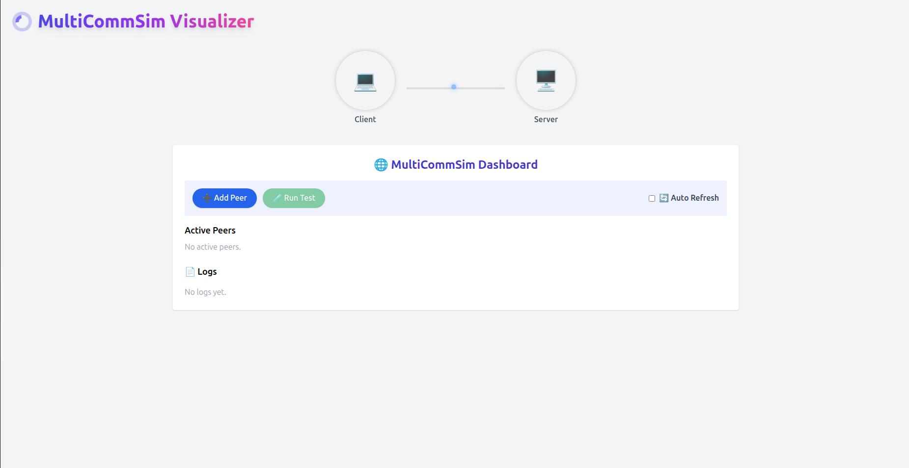
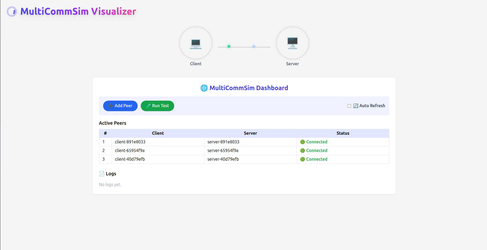
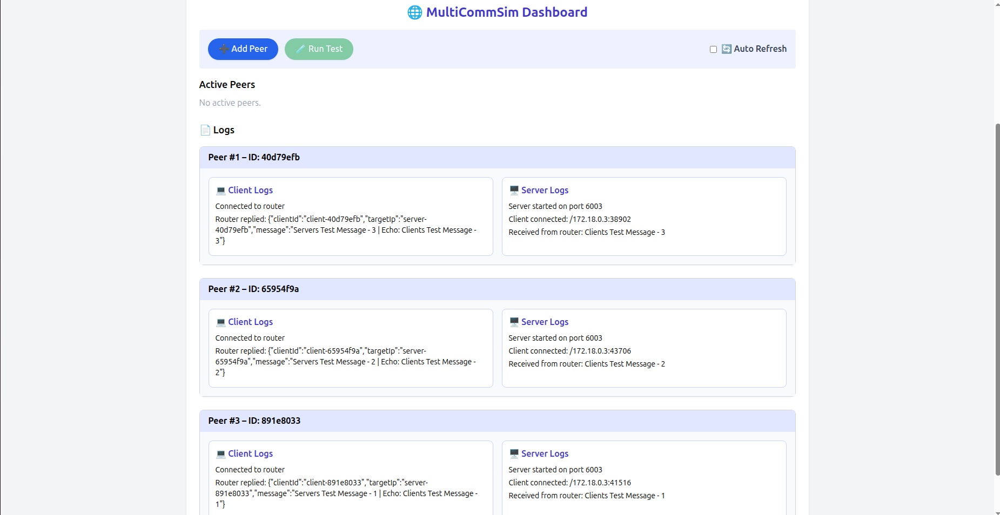
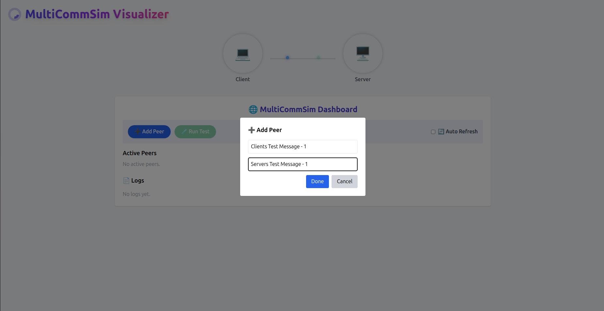

# 🚀 MultiCommSim – Multi Communication Simulator

> TÜBİTAK UZAY destekli bir proje olarak geliştirilen **MultiCommSim**, TCP/IP protokolü üzerinden birçok bağımsız peer (client-server çifti) arasında haberleşmeyi aynı IP ve port üzerinden yöneten **modüler ve ölçeklenebilir** bir simülasyon ortamı sağlar.

---

## 🧠 Optimizasyon Versiyonu Hakkında

> 🔄 **Router katmanının kaldırıldığı optimize edilmiş mimariyi incelemek istiyorsanız**, projenin `optimization` branch’ine geçmeniz gerekmektedir:

```bash
git checkout optimization
```

Bu versiyonda:

- Router modülü sistemden tamamen çıkarılmıştır.
- Client ve Server container’ları doğrudan TCP ile haberleşir.
- Daha basit, daha hızlı ve ölçeklenebilir bir mimari sunar.
- Geliştirilmiş kullanıcı arayüzü ve sadeleştirilmiş backend yapısı içerir.

📄 `optimization` branch’inde **ayrıntılı bir `README.md`** ve **Optimization Addition Report** da bulunmaktadır.

---

## 📁 Proje Yapısı

```
MultiCommSim/
├── api/                   → Python Flask backend (Docker kontrolü)
├── backend/               
│   └── client/            → Java client uygulaması
│   └── server/            → Java server uygulaması
│   └── router/            → Java router Uygulaması
├── docker/                → Dockerfile’lar & compose dosyaları
├── frontend/              → React UI (MultiCommSim Visualizer)
│   └── public/
│   └── src/
├── images/                → UI görselleri
├── documentation/         → Requirements, Design, Final Report
├── requirements.txt       → Flask için bağımlılıklar
├── README.md              → Bu dosya
```

---

## ⚙️ Kurulum & Çalıştırma

### 1️⃣ Bağımlılıkların Kurulumu

> Projeyi çalıştırmadan önce Docker yüklü olmalıdır. Ardından:

```bash
git clone https://github.com/EdizArkin/TUBITAK-UZAY-MultiCommSim
cd MultiCommSim
```

#### Python API

```bash
cd api/
pip install -r requirements.txt
```

#### Backend (Java)

Her üç Java modülü (`client/`, `server/` ve `router/`), çalıştırılabilir `.jar` dosyaları olarak paketlenmelidir. Aşağıdaki komutlar, her modül için Shadow JAR dosyasını üretir:

```bash
cd backend/client
./gradlew shadowJar

cd ../server
./gradlew shadowJar

cd ../router
./gradlew shadowJar
```

> 🔧 Not: Eğer `./gradlew` çalışmıyorsa, önce Gradle Wrapper dosyalarının (`gradlew`, `gradlew.bat`, `gradle/wrapper/`) projenizde bulunduğundan emin olun. Yoksa global Gradle ile şu komutu da kullanabilirsiniz:
>
> ```bash
> gradle shadowJar
> ```

Üretilen `.jar` dosyaları `build/libs/` dizini altında bulunur. Dockerfile’lar bu `.jar` dosyalarını kullanarak container imajlarını oluşturur.

#### Frontend

```bash
cd frontend/
npm install
npm run build
```

### 2️⃣ Docker Ortamını Başlat

```bash
cd docker/
docker compose up --build
```

### 3️⃣ Arayüzü Aç

Tarayıcıdan:

```
http://localhost:3000
```

---

## 🧪 Kullanım Senaryosu

1. **Add Peer** butonuyla yeni bir client-server çifti oluştur.
2. Her peer için özel mesajlar gir (Client Msg, Server Msg).
3. Sistem, bu peer için ayrı Docker container’larda client ve server başlatır.
4. **Run Test** tuşuna basıldığında, client-server iletişimi router üzerinden TCP ile gerçekleşir.
5. Tüm loglar React UI’da detaylı olarak gösterilir.

---

## 🌐 Teknik Mimari Özeti

| Katman        | Teknoloji          | Açıklama |
|---------------|--------------------|----------|
| Arayüz        | React + Tailwind   | Görsel peer yönetimi ve log kontrolü |
| API Katmanı   | Flask (Python)     | Docker ile peer oluşturma ve log çekme |
| Routing       | Java TCP Router    | Tek port üzerinden mesaj yönlendirme |
| Worker Peer’ler| Java              | Gerçek TCP socket haberleşmesi |
| Konteynerleşme| Docker             | İzole peer çalıştırma ortamı |
| Ağ             | Docker Network    | Sanal router ağı (tek port – çok peer) |

---

## 🎯 Özellikler

- ✅ Tek IP ve Port (6003) üzerinden sınırsız client-server eşleşmesi
- ✅ Otomatik peer oluşturma & silme
- ✅ Gerçek zamanlı log takibi
- ✅ TCP mesajlaşma yönlendirme (router → server)
- ✅ Session & connection pool yönetimi
- ✅ Ölçeklenebilir ve gömülü sistemlere uygun yapı

---

## 📄 Teknik Dökümantasyon

Projeye ait 3 kapsamlı döküman repoda yer almaktadır:

| Döküman            | Açıklama |
|--------------------|----------|
| `TUBITAK-UZAY-MultiCommSim – Requirements Document.pdf` | Tüm sistem gereksinimleri detaylı listelenmiştir. |
| `TUBITAK-UZAY-MultiCommSim – Design Document.pdf`       | Yapısal tasarım, mimari bileşenler ve diagramlar yer alır. |
| `TUBITAK-UZAY-MultiCommSim – Final Delivery Report.pdf` | Projenin detaylı finali sunulmuştur. |
| `TUBITAK-UZAY-MultiCommSim – Optimization Additional Report.pdf` | Optimize versiyonunun detayları sunulmuştur. |

> 🧠Final raporunda Özellikle “Port Management” ve “Single Port Multiplexing” bölümleri ve Optimizasyon raporunda "Port Management and TCP Multiplexing " teknik olarak önemlidir.

---

## 📸 Arayüz Görselleri

<p align="center">
  
  
  
  <br/>
  <em>Gelişmiş arayüz ile eş zamanlı peer takibi ve log görüntüleme</em>
</p>

<p align="center">
  
  <br/>
  <em>Peer oluşturma ekranı – client & server mesajları dinamik girilir</em>
</p>

## 📬 İletişim

> Geliştirici: **Ediz Arkın Kobak**  
> Mail: arkinediz@gmail.com  
> LinkedIn: [linkedin.com/in/ediz-arkin-kobak](https://www.linkedin.com/in/ediz-arkin-kobak)

---

> “MultiCommSim, sadece bir haberleşme simülatörü değil; tek porttan sınırsız peer yönetimiyle gömülü sistemler için geleceğe hazır bir altyapıdır.”
