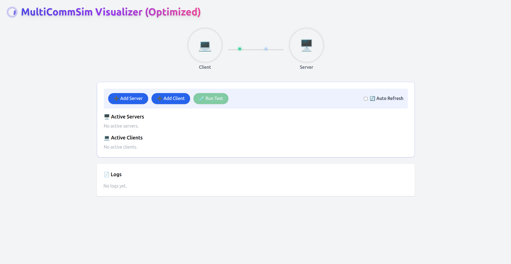
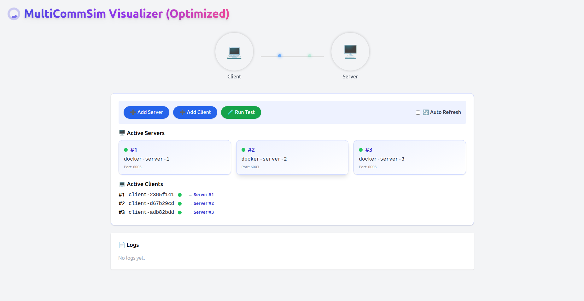
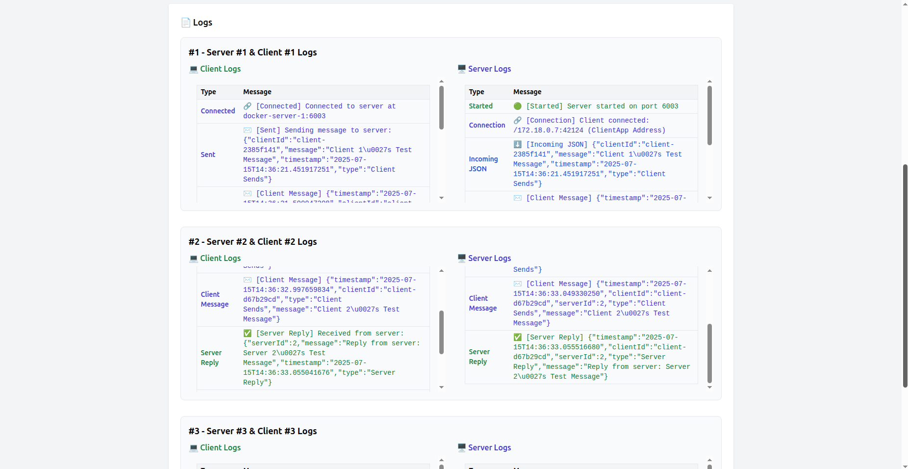
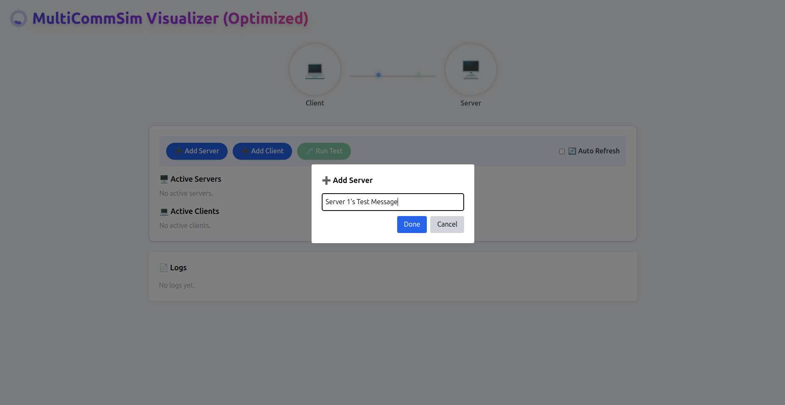
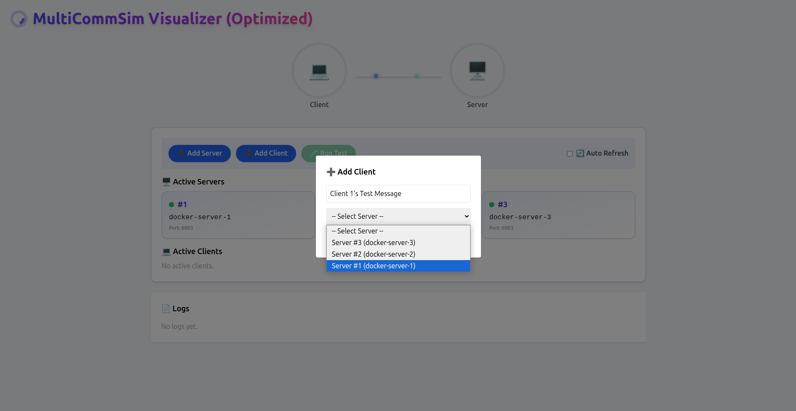

# 🚀 MultiCommSim – Optimized Version

> **MultiCommSim**, TÜBİTAK UZAY destekli, çoklu peer (client-server) haberleşme senaryolarını aynı IP ve tek bir port üzerinden simüle eden bir sistemdir. Bu optimize edilmiş sürümde router modülü kaldırılarak, sistemin verimliliği ve ölçeklenebilirliği artırılmıştır.

---

## 📁 Optimized Proje Yapısı

```
MultiCommSim/
├── api/                   → Python Flask backend (Docker kontrolü)
├── backend/               
│   └── client/            → Java client uygulaması
│   └── server/            → Java server uygulaması
│   └── common/            → Ortak mesaj ve log modülleri
├── docker/                → Dockerfile’lar & compose dosyaları
├── frontend/              → React UI (MultiCommSim Visualizer)
│   └── public/
│   └── src/
├── images/                → UI görselleri
├── documentation/         → Requirements, Design, Final Report
├── requirements.txt       → Flask için bağımlılıklar
├── README.md              → Bu dosya
```

---

## ⚙️ Kurulum & Çalıştırma

### 1️⃣ Gereksinimler

- Docker & Docker Compose
- Python 3.9+
- Node.js 16+

### 2️⃣ Kurulum

```bash
git clone https://github.com/EdizArkin/TUBITAK-UZAY-MultiCommSim
cd MultiCommSim
```

#### Python API

```bash
cd api/
pip install -r requirements.txt
```

#### Backend (Java)

Her iki Java modülü (`client/` ve `server/`), çalıştırılabilir `.jar` dosyaları olarak paketlenmelidir. Aşağıdaki komutlar, her modül için Shadow JAR dosyasını üretir:

```bash
cd backend/client
./gradlew shadowJar

cd ../server
./gradlew shadowJar
```

> 🔧 Not: Eğer `./gradlew` çalışmıyorsa, önce Gradle Wrapper dosyalarının (`gradlew`, `gradlew.bat`, `gradle/wrapper/`) projenizde bulunduğundan emin olun. Yoksa global Gradle ile şu komutu da kullanabilirsiniz:
>
> ```bash
> gradle shadowJar
> ```

Üretilen `.jar` dosyaları `build/libs/` dizini altında bulunur. Dockerfile’lar bu `.jar` dosyalarını kullanarak container imajlarını oluşturur.

#### Frontend

```bash
cd frontend/
npm install
npm run build
```

### 3️⃣ Sistemi Başlat

```bash
cd docker/
docker compose up --build
```

### 4️⃣ Arayüzü Aç

```bash
http://localhost:3000
```

---

## 🧪 Kullanım Adımları

1. React arayüzünde **Add Server** ile yeni bir server başlat.
2. Listelenen serverlardan birini seçip **Add Client** üzerinden mesaj girerek client başlat.
3. Client, seçtiğin server’a bağlanarak mesaj gönderir.
4. **Run Test** ile tüm loglar toplanır ve arayüzde görüntülenir.

---

## 🌐 Teknolojiler ve Katmanlar

| Katman         | Teknoloji          | Açıklama |
|----------------|--------------------|----------|
| **Arayüz**     | React + Tailwind   | Peer yönetimi, log takibi |
| **API Katmanı**| Flask (Python)     | Docker container kontrolü |
| **Routing**    | Yok (optimize)     | Client-server doğrudan TCP ile konuşur |
| **Client/Server** | Java            | TCP Socket üzerinden mesajlaşma |
| **İzole Ağ**   | Docker Bridge      | Tüm iletişim internal network üzerinden |
| **Container Yönetimi** | Docker     | Her peer kendi container'ında |

---

## 🎯 Özellikler

- ✅ Router kaldırılarak tekil hata noktası ortadan kaldırıldı
- ✅ Tüm iletişim Docker internal ağı üzerinden, tek port (6003) ile yönetilir
- ✅ Server ID’si ile eşleşme sayesinde yönlendirme basitleştirildi
- ✅ Gerçek zamanlı log görüntüleme
- ✅ Aynı anda birden fazla peer aktif şekilde yönetilebilir
- ✅ İzole ortam sayesinde çakışma yaşanmadan genişletilebilir yapı

---

## 📄 Teknik Dökümantasyon

Projeye ait 3 kapsamlı döküman repoda yer almaktadır:

| Döküman            | Açıklama |
|--------------------|----------|
| `TUBITAK-UZAY-MultiCommSim – Requirements Document.pdf` | Tüm sistem gereksinimleri detaylı listelenmiştir. |
| `TUBITAK-UZAY-MultiCommSim – Design Document.pdf`       | Yapısal tasarım, mimari bileşenler ve diagramlar yer alır. |
| `TUBITAK-UZAY-MultiCommSim – Final Delivery Report.pdf` | Projenin detaylı finali sunulmuştur. |
| `TUBITAK-UZAY-MultiCommSim – Optimization Additional Report.pdf` | Optimize versiyonunun detayları sunulmuştur. |

> 🧠Final raporunda Özellikle “Port Management” ve “Single Port Multiplexing” bölümleri ve Optimizasyon raporunda "Port Management and TCP Multiplexing " teknik olarak önemlidir.

---

## 📸 Arayüz Görselleri

<p align="center">
  
  
  
  <br/>
  <em>Gelişmiş arayüz ile eş zamanlı peer takibi ve log görüntüleme</em>
</p>

<p align="center">
  
  <br/>
  <em>Server oluşturma ekranı</em>
</p>

<p align="center">
  
  <br/>
  <em>Client oluşturma ve Server'a bağlama ekranı</em>
</p>

---

## 📬 İletişim

> Geliştirici: **Ediz Arkın Kobak**  
> Mail: arkinediz@gmail.com  
> LinkedIn: [linkedin.com/in/ediz-arkin-kobak](https://www.linkedin.com/in/ediz-arkin-kobak)

---

> “MultiCommSim, sadece bir haberleşme simülatörü değil; tek porttan sınırsız peer yönetimiyle gömülü sistemler için geleceğe hazır bir altyapıdır.”
